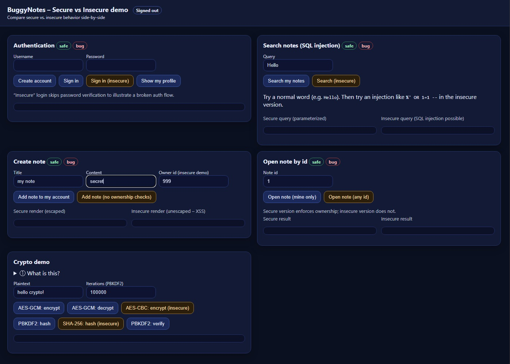
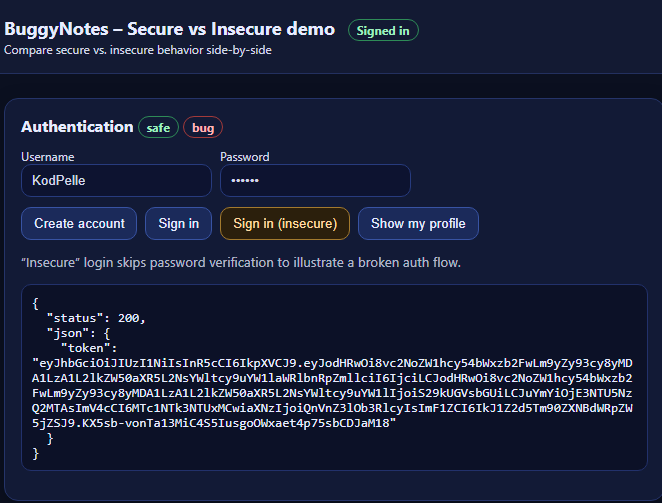
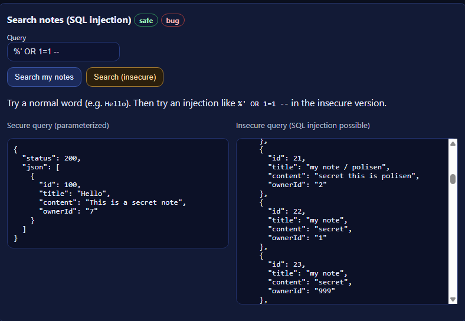
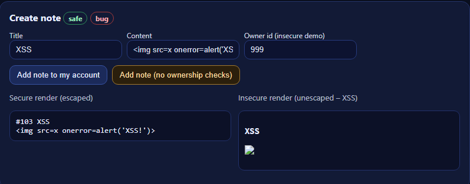
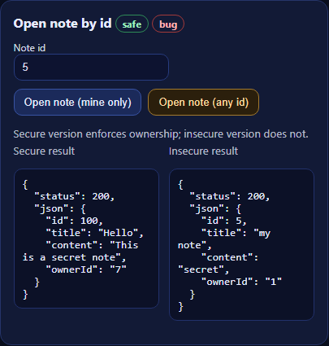
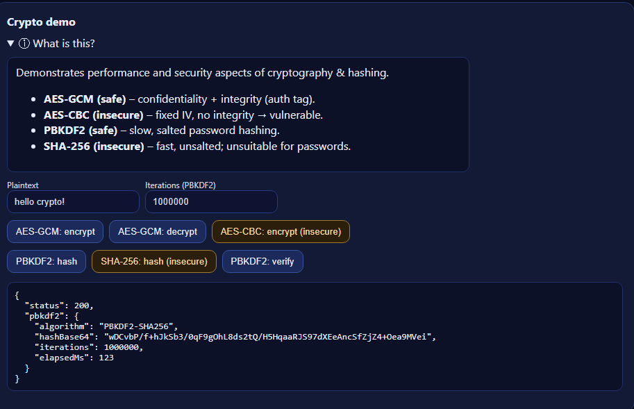

# BuggyNotes – Secure vs Insecure demo
BuggyNotes is a minimal demo application that shows **secure vs insecure coding practices** side-by-side.  
It is intended **for learning purposes only** in the context of developer security training.  

BuggyNotes is a minimal demo application that shows secure vs insecure coding practices side-by-side.
It is intended for learning purposes only in the context of developer security training.



## What the demo shows

1. Authentication

Sign in (secure): verifies the password hash.

Sign in (insecure): skips password verification.

Show my profile: calls `/me` and requires a valid JWT.



2. Search notes (SQL injection)

Secure: `/notes/search-safe` uses EF Core parameterization.

Insecure: `/notes/search-bug` uses `FromSqlRaw` with string interpolation.

Try a normal query like `Hello`, then try `%` or `%' OR 1=1 --` against the insecure endpoint.



3. Create note (XSS)

Secure render: server returns JSON and the UI writes with `textContent`.

Insecure render: the UI uses `innerHTML`, so a payload like `` will execute.



4. Open note by id (IDOR / broken object level auth)

Secure: `/notes/{id}` checks that the note belongs to the signed-in user.

Insecure: `/notes-bug/{id}` returns any note regardless of owner.



5. Crypto demo

AES-GCM (safe): authenticated encryption with nonce and tag.

AES-CBC (insecure demo): fixed IV and no integrity tag.

PBKDF2 (safe): salted, iterated hashing.

SHA-256 (insecure for passwords): fast and unsalted.



## Requirements

- .NET 9 SDK or newer
- Windows PowerShell

You do not need to install SQLite separately. The app uses a local SQLite database file through EF Core.

## Run locally

From the repository root:

```powershell
cd BuggyNotes.Api
dotnet user-secrets set "Jwt:Secret" "D3v_Sup3r_Long_Random_Secret_$(New-Guid)"
dotnet run
```

The app listens on `http://localhost:5015` by default.

On first run, EF Core migrations are applied automatically and a local SQLite database file named `buggynotes.db` is created in `BuggyNotes.Api/`.

## First-time usage

There is no seeded user in the repository. After the app starts:

1. Open `http://localhost:5015`
2. Register a user in the Authentication section
3. Sign in with that same user
4. Use the token-backed demo features from the UI

## Reset the demo

To start from a clean database, stop the app and delete `BuggyNotes.Api/buggynotes.db`, then run `dotnet run` again.

## Notes

- `Demo:InsecureMode` is enabled in `BuggyNotes.Api/appsettings.json`.
- You can provide `Jwt:Secret` through an environment variable instead of user-secrets if you prefer.
- The previous README said `.NET 8` and listed SQLite as a separate prerequisite; both were out of date.
